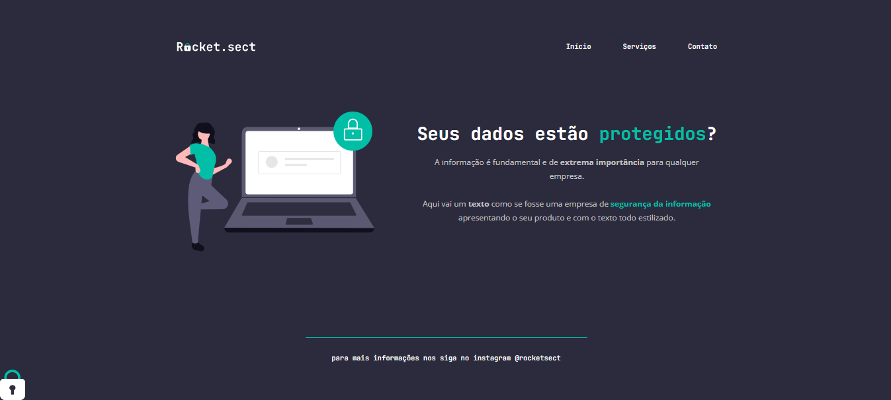

<h1 align="center"> Rocket.sect </h1>
 

  

## 🚀 Tecnologias

Esse projeto foi desenvolvido com as seguintes tecnologias:

- HTML e CSS
- Git e Github
- Figma

## 💻 Projeto

Esse projeto foi desenvolvido para treinamento de estilização e posicionamento, aprendizado na utilização do display grid e suas ferramentas de alinhamento.

- [Acesse o projeto finalizado, online]()

## 🔖 Layout

Você pode visualizar o layout do projeto através [DESSE LINK](https://www.figma.com/file/LkzCtnMB5bbz57LPDL63qz/Explorer-Copy?fuid=1286446084273033097). É necessário ter conta no [Figma](https://figma.com) para acessá-lo.